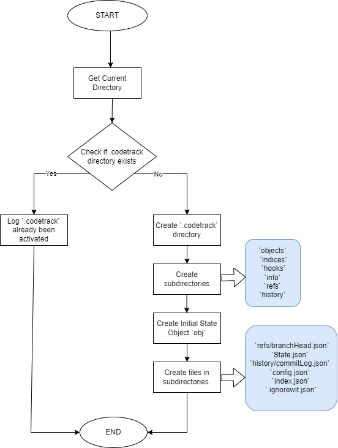
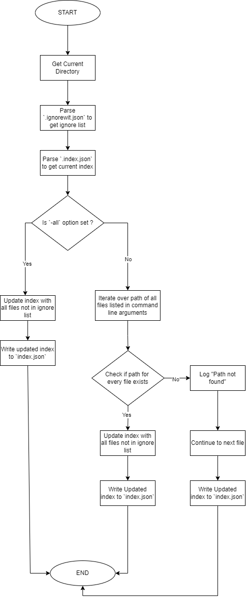
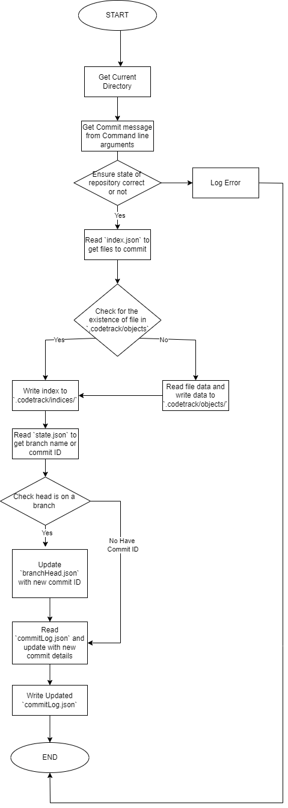
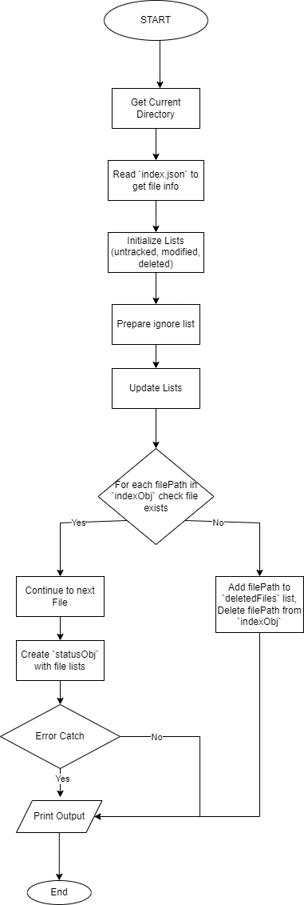
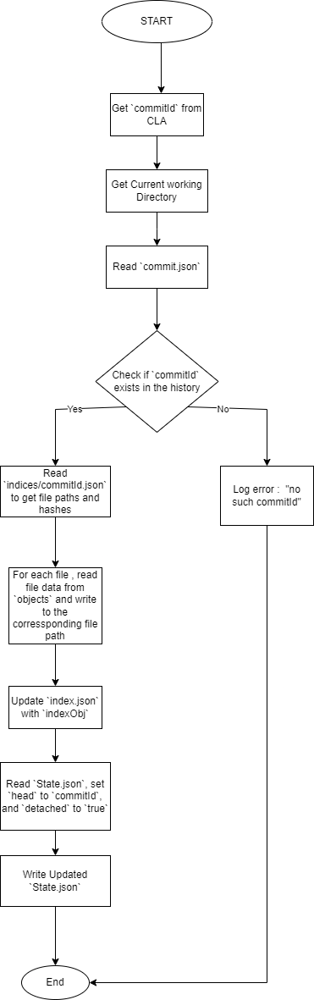
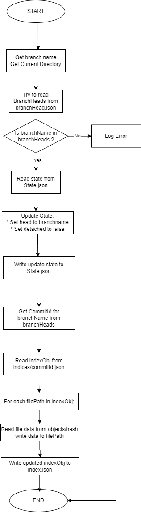
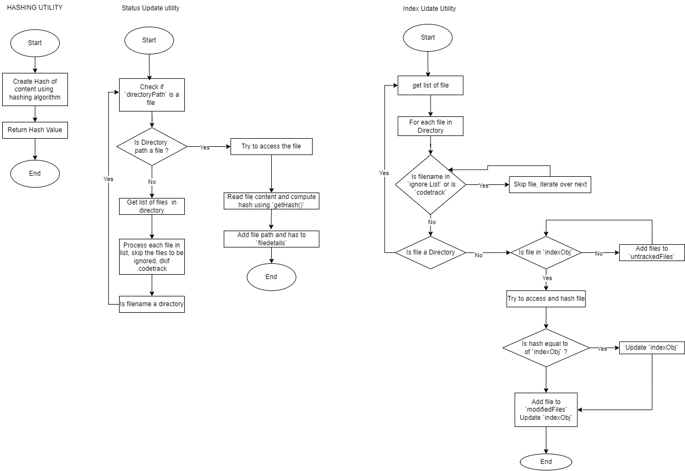

---
# ARCHITECTURE DIAGRAMS

## Architecture Design of Modular Components
 

___

## 1. `init` PROGRAM FLOWCHART

___
## 2. `add` PROGRAM FLOWCHART

___
## 3. `commit` PROGRAM FLOWCHART

___
## 4. `log` PROGRAM FLOWCHART

___
## 5. `status` PROGRAM FLOWCHART

___
## 6. `getImage` PROGRAM FLOWCHART

___
## 7. `ckeckout` PROGRAM FLOWCHART

___
## 8. `utilities` Functions FLOWCHART

___

